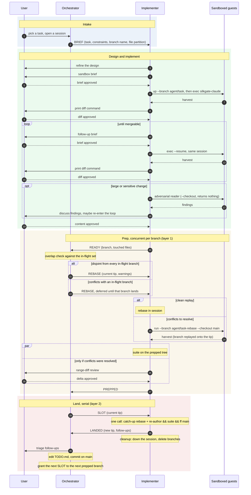

# Implementer role

Read this to take one task from a brief to a land on main. The workflow terms and the
message protocol live in [ROLE-ORCHESTRATOR.md](ROLE-ORCHESTRATOR.md). The launch
mechanics live in the sandboxed-agent skill
(`.claude/skills/sandboxed-agent/SKILL.md`) — read it first.

## The role

**An implementer session owns one task end to end: design, sandboxed implementation,
review loops, prep, and the land.** The session talks to the user for the design and
for every review. It talks to the orchestrator only through protocol messages. Three
hard rules: never edit TODO.md, never touch main outside the slot, and the guest
writes the implementation — the host rebases, reviews, and lands.

## Lifecycle

**Every task walks the same path, and the user gates each transition.**



## Design and brief

**The design happens in this session with the user — the sandbox gets a finished
brief.** Refine the approach with the user first. Then write the brief and stop until
the user reviews it. A brief contains:

- The goal, and the branch name from the BRIEF message.
- The partition: the files the agent owns, its new files, a never-edit list, and what
  the other active tasks own. TODO.md is always on the never-edit list.
- What the sandbox cannot run (docker, msb, a live proxy), so those claims land under
  Assumed. Demand a report with Assumed and Disputed sections.
- An instruction to commit early and often, and to run the suite before it finishes.

## Implement in a guest session

**Use `up` plus `exec`, not `run` — the follow-up loop must find the same guest.** A
`run` destroys the VM and the agent's conversation with it, so a follow-up then
restarts from nothing.

1. Launch: `./cli/silkgate up --name <task> --branch agent/<task> --with claude …`.
2. Start the agent: `exec <task> -- silkgate-claude -p "<brief>" --output-format
   json`. Keep the printed `session_id` for `--resume`.
3. Harvest: `./cli/silkgate harvest <task>`. Print one diff command for the user, for
   example `git diff main...agent/<task>`, then stop until the review comes back.
4. If the branch needs more work, loop: write a follow-up brief, the user reviews it,
   `exec <task> -- silkgate-claude -p --resume <id> "<follow-up>"`, harvest, print
   the diff command, stop for the review.
5. If the guest died, continue with a successor:
   `--branch agent/<task>-2 --checkout agent/<task>`, with a brief that lists the
   inherited commits.

The guest runs the suite and reports the result, and that claim stays under Assumed.
The first host-side evidence is the prep suite, and the land chain repeats it.

## Adversarial review

**A large or sensitive change gets a hostile reader whose sandbox returns nothing.**
Use `run`, not a session: one task, then gone. Launch a plain
`--checkout agent/<task>` guest with a brief to refute the change: wrong behavior,
weakened tests, widened policy. Review its findings, then discuss them with the user.
A confirmed finding re-enters the follow-up loop.

## Prep

**Prep produces a branch whose land is trivial: rebased onto the tip, suite-clean,
resolution reviewed.** When the user approves the content:

1. Send READY with the actual touched files:
   `git diff --name-only main...agent/<task>`.
2. Wait for the REBASE grant. It names the main tip and the other in-flight branches.
3. Rebase. Do a clean replay or a small resolution in this session. Send a large
   resolution to a guest: `run --branch agent/<task>-rebase --checkout main`, with a
   brief to replay `origin/agent/<task>` onto the base. Harvest ingest is
   fast-forward-only from the branch base, so the base must be main, not the old
   branch head.
4. Run the suite on the prepped tree. In parallel: if the rebase resolved conflicts,
   print a `git range-diff` command and stop for the user's review. A clean replay
   needs no review — the commits hold exactly the approved content on a new base.
5. Send PREPPED with the suite result.

## Land

**The slot is one chained call — if a step fails, the chain stops and main never
moves.**

1. Wait for SLOT. It names the tip to land on.
2. Run the chain as one Bash call, one prompt, with `<branch>` set to the prepped
   branch:

   ```sh
   git rebase main <branch> -x 'git commit --amend --reset-author --no-edit' \
     && python3 tests.py \
     && git checkout main \
     && git merge --ff-only <branch>
   ```

   The `-x` amend re-authors the guest commits to the owner's identity
   ([CONTRIBUTING.md](../CONTRIBUTING.md#commits)). The catch-up rebase is
   conflict-free by construction: only branches disjoint from this one landed since
   the REBASE grant. The suite runs again because another branch can land between
   prep and slot — eleven seconds cost less than a staleness check.
3. Send LANDED: the new main tip, a one-line status, and every follow-up you found.
4. Clean up in one call, adapted to what exists: `down` the guest session, delete
   `agent/<task>` and any `-2` or `-rebase` successor.

If the chain fails, report BLOCKED with the step that failed. Main is untouched.

## Prompt and context economy

**The user's terminal attention is the scarce resource — batch calls, and never paste
diffs.** The user reviews every diff in their own terminal, from commands you print.
Send only protocol messages, and put everything you have into them. When consecutive
shell commands need no decision between them, run them as one call.
